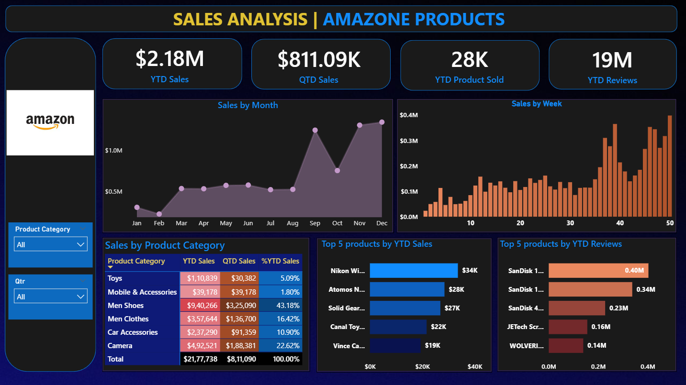

# Amazon Sales Analysis Dashboard

An interactive Power BI dashboard designed to analyze Amazon product sales performance and identify key business trends.

## 📊 Project Overview

This project analyzes Amazon sales data to understand revenue performance, product trends, customer engagement, and category-level performance.

The dashboard provides an interactive view of key business metrics and helps identify high-performing products and sales patterns.

## 🛠️ Tech Stack

- Power BI
- DAX
- Microsoft Excel
- Data Cleaning
- Data Visualization
- Business Intelligence

## 📈 Key Analysis

- Year-to-Date (YTD) sales performance
- Total revenue
- Product performance
- Category analysis
- Sales trends
- Customer engagement metrics
- Top-performing products
- Comparative performance analysis

## 📊 Dashboard



## 📁 Project Structure

```text
amazon-sales-analysis-powerbi/
│
├── dashboard/
│   └── Amazon_Sales_Dashboard.pbix
│
├── data/
│   └── amazon_sales_data.xlsx
│
├── images/
│   └── dashboard_preview.png
│
└── README.md
